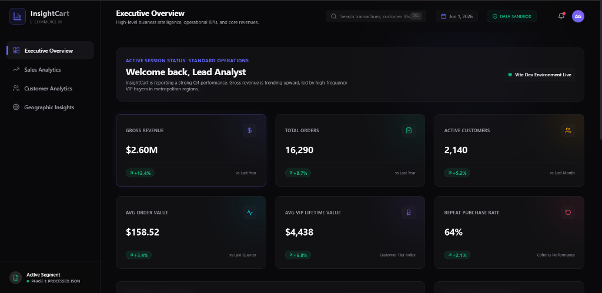

# InsightCart - E-Commerce Analytics Platform

[](https://react.dev/)
[](https://www.typescriptlang.org/)
[](https://vite.dev/)
[](https://tailwindcss.com/)
[](https://recharts.org/)

**InsightCart** is a premium, enterprise-grade business intelligence and analytics dashboard engineered to transform raw transaction logs into actionable operational insights. Designed around the aesthetic language of modern SaaS tools (Stripe, Linear, Vercel), it utilizes dark modes, glassmorphism card blur states, dynamic charts, and cohort retention models.

---

## 🖥 User Interface Preview



---

## 📈 Platform Highlights & Impact
* **Unified BI Overview**: Interconnects monthly transaction trends, product category splits, and regional distribution to deliver immediate business assessments.
* **Segment Profiling**: Classifies customer cohorts (VIP, Regular, At Risk) to help marketing and logistics teams optimize win-back and retention strategies.
* **Analyst-Driven KPIs**: Displays sophisticated customer metrics—such as Customer Lifetime Value (CLV), Repeat Purchase Rate (RPR), and Average Order Value (AOV).
* **Multi-Format Architecture**: Structurally separates raw database transaction assets from refined, processed records, preparing the repository for advanced analytics.

---

## 🛠 Tech Stack
* **Core**: React 19, TypeScript, Vite
* **Styling & UI**: Tailwind CSS (Dark Theme, Glassmorphism card borders, Backdrop-blurs)
* **Visualization**: Recharts (Gradient AreaCharts, Donut charts, Custom Tooltips)
* **Animations**: Framer Motion (Slide-ups, Fade-ins, Hover glows)
* **Icons & Helpers**: Lucide React, `clsx`, `tailwind-merge`

---

## 📂 Project Architecture
```
insightcart/
├── data/
│   ├── raw/                 # Unrefined source data files
│   └── processed/           # Standardized, cleaned JSON datasets for app rendering
├── src/
│   ├── components/
│   │   ├── dashboard/       # Recharts and KPI cards
│   │   └── layout/          # Sidebar, Header
│   ├── pages/               # Executive Overview, Sales, Customer, and Geographic views
│   ├── types/               # TypeScript interfaces
│   ├── lib/                 # Utility class mixers (cn)
│   ├── App.tsx              # View router and state coordinator
│   └── main.tsx             # Application entry point
├── analysis/
│   ├── sql/                 # Standalone SQL analytics queries
│   └── business-insights/   # Executive summary findings and recommendations
└── README.md
```

---

## ⚡ Setup & Development
To launch the development server locally:

1. **Install Dependencies**:
   ```bash
   npm install --legacy-peer-deps
   ```
2. **Start Dev Server**:
   ```bash
   npm run dev
   ```
3. **Build Bundle**:
   ```bash
   npm run build
   ```

---

## 🔍 SQL Query Modules (`/analysis/sql/`)
* [sales_analysis.sql](analysis/sql/sales_analysis.sql): Calculates daily transactions volume, monthly revenue growth trends, and city sales distributions.
* [customer_analysis.sql](analysis/sql/customer_analysis.sql): Calculates Purchase Frequency, Customer Lifetime Value (CLV) estimations, and Repeat Purchase Rates (RPR).
* [product_analysis.sql](analysis/sql/product_analysis.sql): Breaks down category sales volumes, monthly popularity, and city-to-category purchasing matrices.

---

## 🎯 Executive Findings & Strategy (`/analysis/business-insights/`)
Read the complete strategic report in [findings.md](analysis/business-insights/findings.md):
* **VIP Loyalty Retention**: VIP segment generates over **57%** of cumulative revenue; recommendations focus on premium retention loyalty loops.
* **Geographical Expansion**: Highlights Mumbai and Delhi as top regional shipping nodes, driving directives to localize last-mile fulfillment.

---

## 🔮 Future Development Roadmap
1. **Phase 1 (Current)**: High-fidelity processed JSON sandbox.
2. **Phase 2**: Python Data Cleaning scripts to automate raw data cleaning.
3. **Phase 3**: SQL Database integrations and automated query loaders.
4. **Phase 4**: API integrations to pull live warehouse logs.
5. **Phase 5**: Advanced RFM customer clustering modeling.
6. **Phase 6**: Predictive sales trend forecasting.
7. **Phase 7**: Interactive Power BI dashboard builds.
